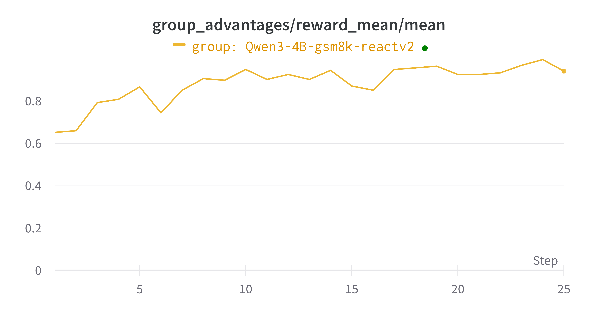

# Training Using Complex Agent Workflows.

This example serves as a demonstration for adapting the Trinity-RFT training workflow to your own agentic project, through our OpenAI-compatible `ModelWrapper` class.

Here, we use the [AgentScope](https://github.com/modelscope/agentscope) framework as an example, but you can certainly use any other framework, as Trinity offers great flexibility. This example fine-tunes a model on the GSM8K math dataset by leveraging an agent that uses ReAct-style reasoning with native tool calls.

## Key Features Demonstrated

This example highlights several advanced capabilities of the Trinity-RFT framework:

### Seamless Integration with External Agent Frameworks
Trinity-RFT is designed to be highly modular. You can easily embed complex, pre-existing agent logic from external frameworks like AgentScope directly into a Trinity `Workflow`.

- **No Need for Rewrites**: You don't have to re-implement the intricate logic of your agent (e.g., the ReAct loop, memory management, or tool invocation) within Trinity.
- **Focus on High-Level Orchestration**: As shown in our `AgentScopeReactV2Gsm8kWorkflow`, the Trinity workflow simply initializes and calls the external agent's `reply` method. Trinity abstracts away the underlying complexity, allowing you to focus on the high-level task orchestration and reward design.

### General Multi-Turn Training
Modern agentic tasks often involve multiple steps of reasoning, tool use, and observation. Trinity-RFT natively supports training across these multi-turn interactions.

- **Step-Wise Experience Generation**: Instead of only learning from the final answer, Trinity can treat each step within an agent's reasoning trajectory as a distinct learning opportunity.
- **Credit Assignment**: The reward for solving a task is propagated back to all experiences within the successful trajectory, enabling the model to learn the entire reasoning chain, not just the final response. This is controlled by the `add_strategy` in the config.

### Native Tool Calling Support
Trinity-RFT's inference engine and training pipeline are built to support the native OpenAI `tool_calls` format.

- **Direct Training on Tool Use**: The framework allows the model to be trained on deciding *when* to call a tool, *which* tool to call, and *what* arguments to use, all formatted in the standard `tool_calls` convention.
- **Interoperability**: This native support ensures seamless integration with any service or environment that consumes the OpenAI API format, such as an `MCP_server` (Multi-Agent Collaboration Platform) or other tool-use evaluators.

## How It Works

Below we show you how to perform this step-by-step.

### The Workflow (`workflow.py`)

The core logic is encapsulated in the `AgentScopeReactV2Gsm8kWorkflow` class.

1.  **Initialization (`__init__`)**:
    - It first initializes the AgentScope environment and the desired agent (`ReActAgentV2`).
    - The most critical integration step is injecting Trinity's model client into the AgentScope agent:
      ```python
      self.openai_client = model.get_openai_client()
      # ...
      self.agent.model.client = self.openai_client
      ```
      This ensures that all API calls made by the AgentScope agent are routed through Trinity's `ModelWrapper`, which records the entire conversation history.

2.  **Execution (`run`)**:
    - The `run` method is remarkably simple. It just passes the task description to the agent.
      ```python
      content = self.agent.reply(msg).content
      ```
    - After the agent completes its multi-step reasoning and produces a final answer, Trinity extracts all the intermediate turns from the model's history:
      ```python
      experiences = self.model.extract_experience_from_history(clear_history=True)
      ```
    - A reward is calculated based on the final answer and is applied to all `Experience` objects generated from the trajectory. These experiences are then sent to the buffer for training.

### The Configuration (`config.yaml`)

The configuration file fine-tunes the behavior of the entire system. Here are the key parameters for this example:

#### Native Tool Calling Settings

These settings in the `explorer.rollout_model` section configure the VLLM-based engine to generate and parse OpenAI-compatible tool calls.
We use the `Qwen3` model and host model with vllm. The configuration for different model can be found in [VLLM Toolcalls](https://docs.vllm.ai/en/stable/features/tool_calling.html#qwen-models)


```yaml
explorer:
  rollout_model:
    engine_type: vllm_async
    # ...
    enable_auto_tool_choice: true # Enables the model to generate `tool_calls`
    tool_call_parser: hermes       # Specifies the parser for formatting tool call outputs
    reasoning_parser: deepseek_r1  # Helps in parsing the model's thought process
    enable_thinking: true          # Enables the model to generate intermediate "thoughts"
```

#### Multi-Turn Training Strategy

This setting in the `algorithm` section defines how experiences from a multi-turn rollout are processed.

```yaml
algorithm:
  algorithm_type: grpo
  add_strategy: step_wise_grpo # Key for multi-turn training
```
-   `step_wise_grpo`: This strategy tells Trinity to create a distinct training sample for each step in the agent's execution path. The `grpo` algorithm then uses these samples to update the model.

#### Asynchronous Synchronization for Efficiency

Because multi-turn rollouts produce a variable number of experiences, waiting for a fixed number of *rollouts* is inefficient. We use a dynamic synchronization strategy.

```yaml
synchronizer:
  sync_style: dynamic_by_explorer # Start training when enough experiences are ready
  sync_interval: 2
```
-   `sync_style: dynamic_by_explorer`: The trainer starts a training job as soon as the buffer has collected enough *experiences* (i.e., individual turns), rather than waiting for a fixed number of full agent trajectories. This significantly improves GPU utilization and training throughput.

## How to Run the Example

1.  **Prerequisites**: Ensure you have Trinity installed, along with the dependencies for this example (e.g., `agentscope`). Please refer to [Agentscope Github link](https://github.com/modelscope/agentscope).

2. Download the model you want to use, and fill in the configuration files in `examples/agentscope_gsm8k/agentscope_gsm8k.yaml`

3.  **Launch the training job**: Run the following command from the root directory of the repository.

    ```bash
    trinity run --config examples/agentscope_gsm8k/agentscope_gsm8k.yaml
    ```

The example here is simple and it can converge in a few minutes on 8 H20 GPUs.




## Summary

This example is simple but demonstrates the power and flexibility of Trinity for training complex, multi-turn agents that use tools. By seamlessly integrating external agentic logic and providing native support for multi-turn training and tool calls, Trinity-RFT empowers you to fine-tune models on sophisticated, realistic tasks with high efficiency.
